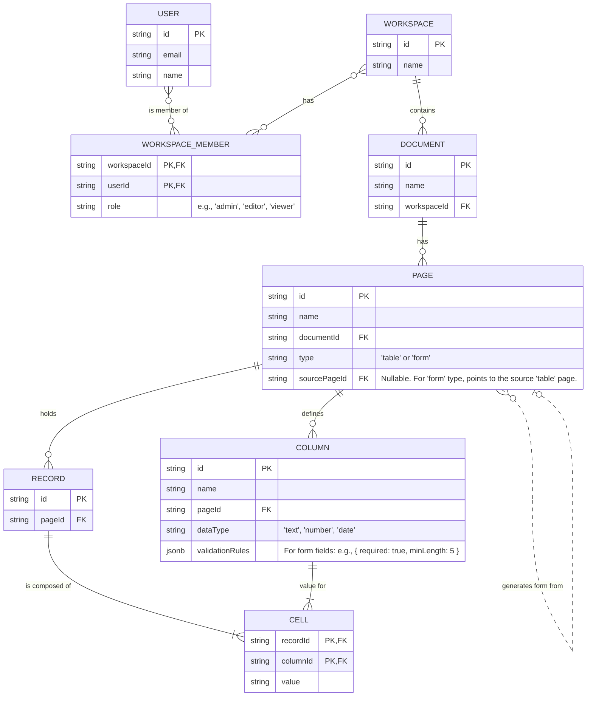

# IntelliSheet 架構規劃文件

## 1. 專案結構與理念

### 1.1. 程式碼庫策略：Monorepo

為了最大化開發效率、簡化依賴管理並促進前後端之間的程式碼共享（尤其是 TypeScript 型別），我們決定採用 **Monorepo**（單一程式碼庫）架構。

- **優點**:
    - **型別安全**: 前後端共享 TypeScript 型別定義，減少介面不匹配的錯誤。
    - **原子化提交**: 相關的前後端變更可以在同一個 commit 中完成，使版本歷史更清晰。
    - **簡化的開發流程**: 可以用單一指令同時啟動前後端開發環境。

- **目標資料夾結構**:
  ```
  intellisheet-claude-mvp/
  ├── packages/
  │   ├── backend/      # 後端應用 (Node.js/Express)
  │   ├── frontend/     # 前端應用 (React/Vite)
  │   └── shared/       # 共用程式碼 (例如：TypeScript 型別)
  ├── package.json      # 根 package.json，設定 workspaces
  └── ...
  ```

## 2. 後端技術棧

- **執行環境**: **Node.js**
- **程式語言**: **TypeScript** (與前端保持一致)
- **Web 框架**: **Express.js** (輕量、靈活，適合快速開發 MVP)
- **ORM**: **Prisma** (提供優異的型別安全與資料庫操作體驗)
- **即時通訊**: **Socket.IO** (對應前端已使用的 `socket.io-client`)
- **身分驗證**: **JWT (JSON Web Tokens)**

## 3. 資料庫選型

### 3.1. 最終選擇：Amazon Aurora Serverless v2 (PostgreSQL 相容)

綜合考量到**長期成本效益**、**可擴展性**、**開發效能**以及**架構一致性**，我們選擇 **Amazon Aurora Serverless v2** 作為我們的資料庫。

- **選擇理由**:
    1.  **立足長遠**: 雖然初期設定比 Neon 等服務複雜，但將所有基礎設施保留在單一 AWS 帳戶內，可以避免未來規模化時產生高昂的跨網域資料傳輸 (Egress) 費用。
    2.  **無冷啟動**: 與 v1 不同，Aurora Serverless v2 能提供即時、毫秒級的回應，確保了互動式應用的使用者體驗。
    3.  **效能與成本兼顧**: 對於流量不穩定的應用程式，它能自動擴展，實現比傳統預配置資料庫更佳的成本效益。
    4.  **生態系整合**: 與 AWS IAM, VPC, CloudWatch 等服務無縫整合，便於統一管理、監控與權限控制。

## 4. 核心資料模型與架構

### 4.1. 組織層級：工作區 -> 文件 -> 頁面

為了有效組織試算表與表單，並為未來的權限與協作功能打下基礎，我們採用三層式結構：

1.  **工作區 (Workspace)**: 最高層級的容器，用於管理成員與權限。
2.  **文件 (Document)**: 工作區內的獨立單位，類似一個 `.xlsx` 檔，可包含多個頁面。
3.  **頁面 (Page)**: 文件的具體呈現，可以是**表格 (table)** 或由表格生成的**表單 (form)**。

### 4.2. 實體關係圖 (ERD)



### 4.3. 設計亮點

- **表單與表格的關聯**: `PAGE` 表中的 `sourcePageId` 欄位巧妙地將 `form` 與其資料來源 `table` 連結起來。
- **靈活的欄位驗證**: `COLUMN` 表中的 `validationRules` 欄位使用 `jsonb` 型別，可以儲存任意複雜的驗證規則，完美支援如 Google 表單般的欄位限制功能。
- **可擴展的視圖**: `PAGE` 的 `type` 欄位讓未來增加如 `kanban`, `calendar` 等新視圖變得容易。
